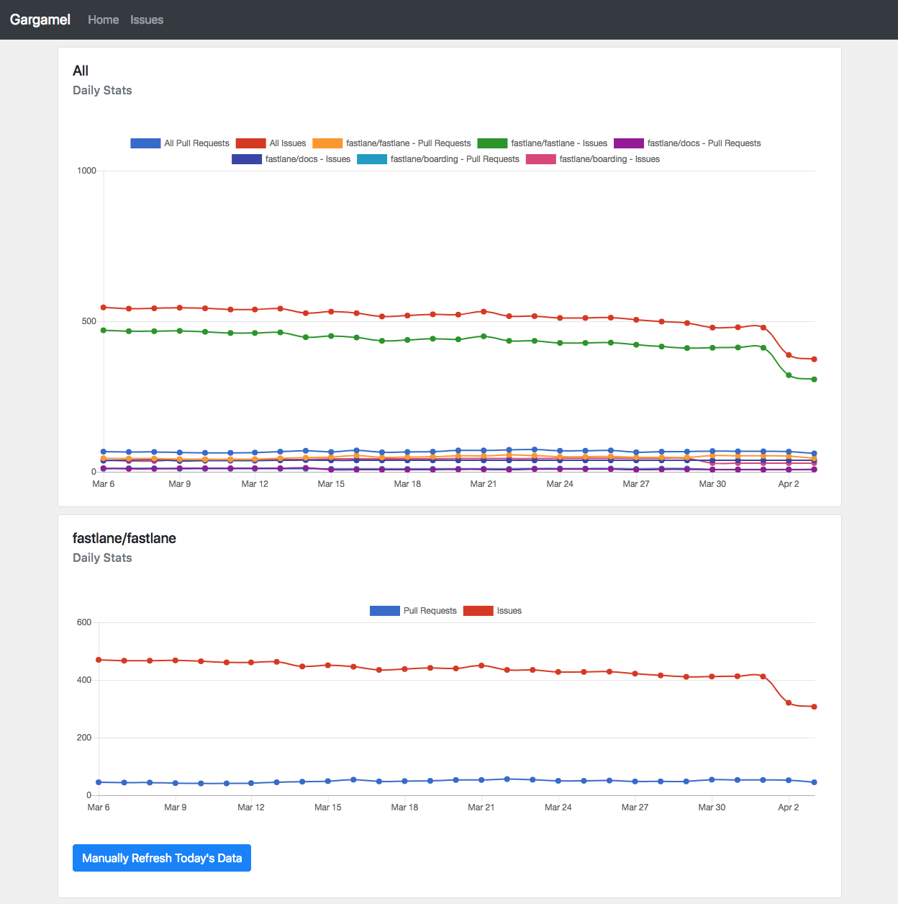
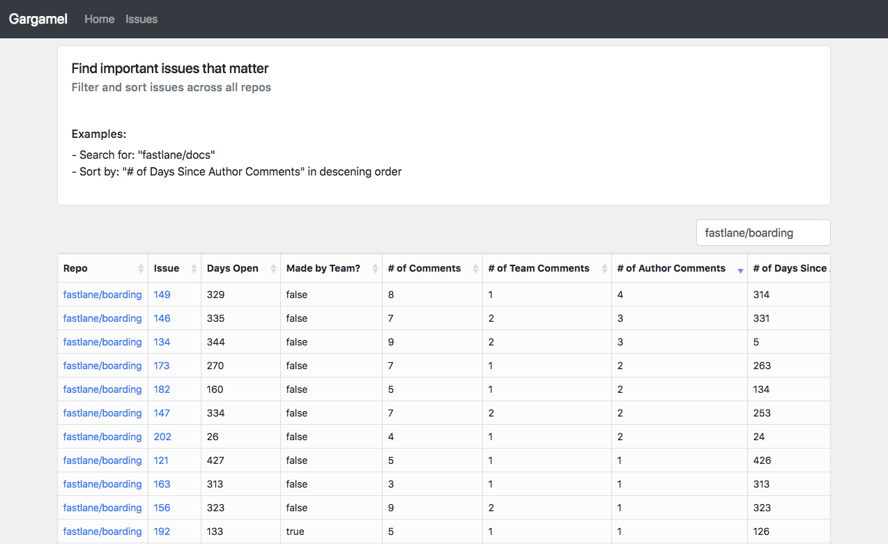

# Gargamel

## Home



## Issues



## Installation

1. `brew install postgres`
1. `brew install redis`
1. `bundle install`
1. Create a `.env` file
    ```
    DATABASE_URL=postgres://localhost/gargamel
    REDIS_URL=redis://localhost:6379
    REDIS_CONNECTIONS_CLIENT=10
    REDIS_CONNECTIONS_SERVER=10

    ADMIN_MODE=true
    ```
  
1. `bundle exec rake db:migrate`

## Running

### Server

1. `bundle exec foreman start dev`

### Daily Stat Job

1. `bundle exec rake garg:daily`


## Development Notes

### Reset database
```sh
drop schema public cascade;
create schema public;
```